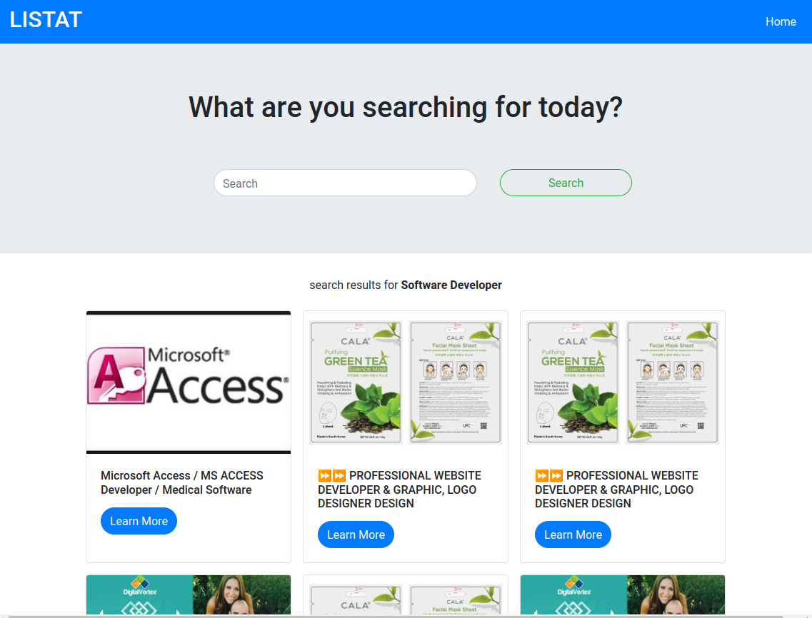

# Craig's List Scrapper

A simple Web scrapper for Craig's List website created with python using Django Framework.


## Libraries and Tools used

- Django
- BeautifulSoup
- Requests
- Bootstrap

## Development

### Requirements

- Python 3
- pip

### Setting the Virtual Environment

```sh
python -m venv env
source env/bin/activate
pip install -r requirements.txt
```

### starting the server

```sh

python manage.py runserver
```

## Deployment

### Collect static files

inside the project directory run the following command

``` sh
python manage.py collectstatic
```

### NGINX configuration

add the following configuration to `/etc/nginx/sites-available` directory and sym link it in the `etc/nginx/sites-enabled` directory.

``` sh
server {
    listen 80;
    server_name SERVER_NAME;
    
    location /static/ {
        alias /path/to/project/static/;
    }
    
    loaction / {
        proxy_pass http://SERVER_NAME:8000/;
    }
}
```

then run `nginx -s reload` to realod the configuration

### Run the Django app

inside the project directory run the following command:

``` sh
gunicorn craigslist_scrapper.wsgi --daemon
```

